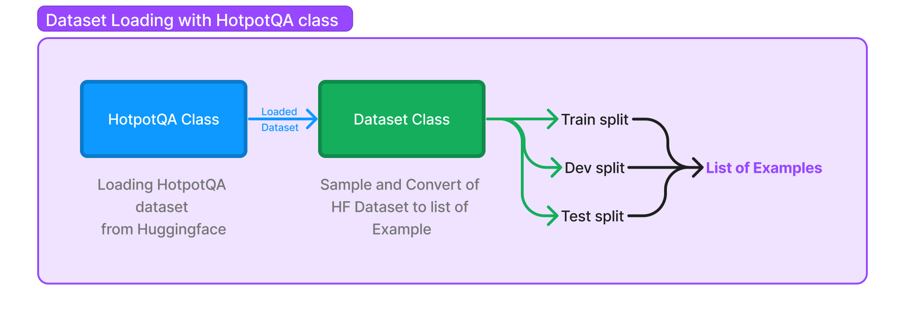

import AuthorDetails from '@site/src/components/AuthorDetails';

# 利用内置数据集

在 DSPy 中使用自己的数据非常简单：数据集只是一个 `Example` 对象的列表。熟练使用 DSPy 包括能够找到并重新利用现有数据集，以全新的方式为您自己的流水线提供服务；DSPy 使这成为一种特别强大的策略。

为了方便起见，DSPy 目前还提供以下内置数据集支持：

* **HotPotQA**（多跳问题回答）
* **GSM8k**（数学问题）
* **Color**（基本颜色数据集）

## 加载 HotPotQA

HotPotQA 是一个包含问题-答案对的集合。

```python
from dspy.datasets import HotPotQA

dataset = HotPotQA(train_seed=1, train_size=5, eval_seed=2023, dev_size=50, test_size=0)

print(dataset.train)
```
**输出:**
```text
[Example({'question': 'At My Window was released by which American singer-songwriter?', 'answer': 'John Townes Van Zandt'}) (input_keys=None),
 Example({'question': 'which  American actor was Candace Kita  guest starred with ', 'answer': 'Bill Murray'}) (input_keys=None),
 Example({'question': 'Which of these publications was most recently published, Who Put the Bomp or Self?', 'answer': 'Self'}) (input_keys=None),
 Example({'question': 'The Victorians - Their Story In Pictures is a documentary series written by an author born in what year?', 'answer': '1950'}) (input_keys=None),
 Example({'question': 'Which magazine has published articles by Scott Shaw, Tae Kwon Do Times or Southwest Art?', 'answer': 'Tae Kwon Do Times'}) (input_keys=None)]
```

我们刚刚加载了训练集（5个示例）和开发集（50个示例）。我们训练集中的每个示例只包含一个问题及其（人工注释的）答案。正如您所见，它被加载为一个 `Example` 对象的列表。然而，需要注意的一点是它并没有隐式地设置输入键，所以这是我们需要做的事情！！

```python
trainset = [x.with_inputs('question') for x in dataset.train]
devset = [x.with_inputs('question') for x in dataset.dev]

print(trainset)
```
**输出:**
```text
[Example({'question': 'At My Window was released by which American singer-songwriter?', 'answer': 'John Townes Van Zandt'}) (input_keys={'question'}),
 Example({'question': 'which  American actor was Candace Kita  guest starred with ', 'answer': 'Bill Murray'}) (input_keys={'question'}),
 Example({'question': 'Which of these publications was most recently published, Who Put the Bomp or Self?', 'answer': 'Self'}) (input_keys={'question'}),
 Example({'question': 'The Victorians - Their Story In Pictures is a documentary series written by an author born in what year?', 'answer': '1950'}) (input_keys={'question'}),
 Example({'question': 'Which magazine has published articles by Scott Shaw, Tae Kwon Do Times or Southwest Art?', 'answer': 'Tae Kwon Do Times'}) (input_keys={'question'})]
```
DSPy通常只需要非常少的标记。而你的流水线可能涉及六七个复杂步骤，你只需要为初始问题和最终答案添加标签。DSPy将为支持你的流水线而需要的任何中间标签进行引导。如果以任何方式更改流水线，那么引导的数据也会相应更改！

## 高级内容：DSPy的`Dataset`类内部（可选）

我们已经看到了如何使用`HotPotQA`数据集类并加载HotPotQA数据集，但它实际上是如何工作的呢？`HotPotQA`类继承自`Dataset`类，后者负责将从源加载的数据转换为训练-测试-开发拆分，所有这些都是*示例列表*。在`HotPotQA`类中，您只需实现`__init__`方法，在这里将HuggingFace中的拆分填充到变量`_train`、`_test`和`_dev`中。其余的过程由`Dataset`类中的方法处理。



但是`Dataset`类的方法是如何将数据从HuggingFace转换的呢？让我们深呼吸，一步一步地思考...就像上面的示例一样，我们可以看到通过`.train`、`.dev`和`.test`方法访问的拆分，那么让我们看一下`train()`方法的实现：

```python
@property
def train(self):
    if not hasattr(self, '_train_'):
        self._train_ = self._shuffle_and_sample('train', self._train, self.train_size, self.train_seed)

    return self._train_
```

如您所见，`train()`方法作为一个属性，而不是一个常规方法。在这个属性中，它首先检查`_train_`属性是否存在。如果不存在，它调用`_shuffle_and_sample()`方法来处理`self._train`，其中加载了HuggingFace数据集。让我们看一下`_shuffle_and_sample()`方法：

```python
def _shuffle_and_sample(self, split, data, size, seed=0):
    data = list(data)
    base_rng = random.Random(seed)

    if self.do_shuffle:
        base_rng.shuffle(data)

    data = data[:size]
    output = []

    for example in data:
        output.append(Example(**example, dspy_uuid=str(uuid.uuid4()), dspy_split=split))
    
        return output
```

`_shuffle_and_sample()`方法做两件事：

* 如果`self.do_shuffle`为True，则对数据进行洗牌。
* 然后从洗牌后的数据中取样大小为`size`的样本。
* 然后循环遍历取样数据，并将`data`中的每个元素转换为一个`Example`对象。`Example`除了示例数据外还包含唯一ID和拆分名称。

将原始示例转换为`Example`对象使得Dataset类可以以标准化的方式处理它们。例如，PyTorch DataLoader使用的整理方法期望每个项目都是一个`Example`。
总结一下，`Dataset` 类处理所有必要的数据处理，并提供了一个简单的 API 来访问不同的数据拆分。这与像 HotpotQA 这样的数据集类有所不同，后者仅需要定义如何加载原始数据。

***

<AuthorDetails name="Herumb Shandilya"/>