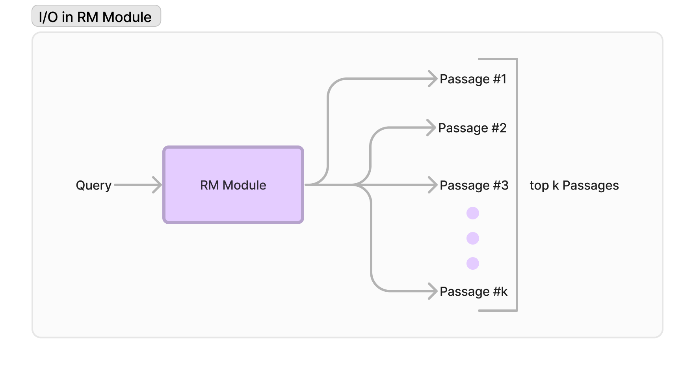

import AuthorDetails from '@site/src/components/AuthorDetails';

# 创建自定义 RM 客户端

DSPy 提供了对各种检索模块的支持，例如 `ColBERTv2`、`AzureCognitiveSearch`、`Pinecone`、`Weaviate` 等。与语言模型（LM）模块不同，创建自定义 RM 模块更加简单和灵活。

目前，DSPy 提供了两种创建自定义 RM 的方式：Pythonic 方式和 DSPythonic 方式。我们将分别介绍这两种方式，了解它们为何表现相同，以及如何实现每种方式！

## RM 客户端的输入输出

在了解实现之前，让我们先了解 RM 模块内的思想和输入输出。

RM 模块的**输入**可以是 1) 单个查询或 2) 查询列表。

**输出**是从检索模型、向量存储或搜索客户端检索的每个查询的 `top-k` 段落。



通常，我们通过 `__call__` 方法简单地调用 RM 模块对象，将查询/查询作为调用的参数，并将相应输出作为字符串列表返回。

我们将看到这种输入输出在两种实现方法中本质上是相同的，但在交付方式上有所不同。

## Pythonic 方式

为了处理我们的 RM 输入输出，我们创建一个执行检索逻辑的类，在 `__init__` 和 `__call__` 方法中实现：

```python
from typing import List, Union

class PythonicRMClient:
    def __init__(self):
        pass

    def __call__(self, query: Union[str, List[str]], k:int) -> Union[List[str], List[List[str]]]:
        pass
```

:::info
不用担心上面繁琐的类型提示。`typing` 是一个提供函数输入和输出类型定义的包。

`Union` 涵盖了参数/输出的所有可能类型。因此：
* `Union[str, List[str]]`: 分配给 `query`，以处理单个查询字符串或查询字符串列表。
* `Union[List[str], List[List[str]]]`: 分配给 `__call__` 的输出，以处理单个查询字符串列表或多个查询字符串列表。
:::

让我们从为托管在端点为 `/` 的 API 上的本地检索模型实现 `PythonicRMClient` 开始。我们首先实现 `__init__` 方法，它简单地初始化类属性 `url` 和 `port`，如果存在端口，则将端口附加到 url。

```python
def __init__(self, url: str, port:int = None):
    self.url = f`{url}:{port}` if port else url
```

现在是时候在 `__call__` 方法中编写检索逻辑了：

```python
def __call__(self, query:str, k:int) -> List[str]:
    params = {"query": query, "k": k}
    response = requests.get(self.url, params=params)

    response = response.json()["retrieved_passages"]    # top-k 段落列表
    return response
```
这段代码代表了我们的 API 请求调用，用于检索我们的**前 k 个段落**列表，并将其作为响应返回。让我们将所有内容整合在一起，看看我们的 RM 类是什么样子的：

```python
from typing import List

class PythonicRMClient:
    def __init__(self, url: str, port:int = None):
        self.url = f`{url}:{port}` if port else url

    def __call__(self, query:str, k:int) -> List[str]:
        # 仅接受单个查询输入，可以随意修改以支持

        params = {"query": query, "k": k}
        response = requests.get(self.url, params=params)

        response = response.json()["retrieved_passages"]    # 前 k 个段落的列表
        return response
```

就是这样！这是实现 RM 模型的最基本方式，与 `ColBERTv2` 和 `AzureCognitiveSearch` 等托管的 DSP-v1 RM 模型相似。

现在让我们看看在 DSPy 中如何简化这个过程！

## DSPythonic 方法

DSPythonic 方法与 Pythonic 方法保持相同的输入，但现在返回一个 `dspy.Prediction` 类对象，这是任何 DSPy 模块的标准输出格式，正如我们在之前的文档中看到的。此外，这个类现在将继承 `dspy.Retrieve` 类，以在 DSPy 库中保持状态管理。

因此，让我们实现 `__init__` 和 `forward` 方法，其中我们的类的 `__call__` 调用 `forward` 方法如下：

```python
import dspy
from typing import List, Union, Optional

class DSPythonicRMClient(dspy.Retrieve):
    def __init__(self, k:int):
        pass

    def forward(self, query: Union[str, List[str]], k:Optional[str]) -> dspy.Prediction:
        pass
```

与 `PythonicRMClient` 不同，我们在初始化调用中初始化了 `k`，当我们调用 `super().__init__()` 时，`forward` 方法将接受查询/查询作为参数，以及可选参数 `k`，用于检索的段落数。在这个继承的 `dspy.Retrieve` 初始化中，我们调用 `super().__init__()` 时会使用 `k`。

我们将为上面使用的相同本地检索模型 API 实现 `DSPythonicRMClient`。我们将首先实现 `__init__` 方法，它与 `PythonicRMClient` 类似。

```python
def __init__(self, url: str, port:int = None, k:int = 3):
    super().__init__(k=k)

    self.url = f`{url}:{port}` if port else url
```

现在我们将实现 `forward` 方法，将输出作为 `dspy.Prediction` 对象返回，在所有 RM 模块中，这个对象的属性是 `passage`，这是标准的。调用将默认使用定义的 `self.k` 参数，除非在此调用中被覆盖。

```python
def forward(self, query:str, k:Optional[int]) -> dspy.Prediction:
    params = {"query": query, "k": k if k else self.k}
    response = requests.get(self.url, params=params)

    response = response.json()["retrieved_passages"]    # 前 k 个段落的列表
    return dspy.Prediction(
        passages=response
    )
```

让我们将所有内容整合在一起，看看我们的 RM 类是什么样子的：
```python
import dspy
from typing import List, Union, Optional

class DSPythonicRMClient(dspy.Retrieve):
    def __init__(self, url: str, port:int = None, k:int = 3):
        super().__init__(k=k)

        self.url = f`{url}:{port}` if port else url

    def forward(self, query_or_queries:str, k:Optional[int]) -> dspy.Prediction:
        params = {"query": query_or_queries, "k": k if k else self.k}
        response = requests.get(self.url, params=params)

        response = response.json()["retrieved_passages"]    # List of top k passages
        return dspy.Prediction(
            passages=response
        )
```
这就是在 DSPy 中实现自定义 RM 模型客户端的方式，以及最近支持的 RM 模型如 `QdrantRM`、`WeaviateRM` 等是如何在 DSPy 中实现的。

让我们看看如何使用这些检索器。

## 使用自定义 RM 模型

DSPy 提供两种使用自定义 RM 客户端的方式：直接方法和使用 `dspy.Retrieve`。

### 直接方法

使用自定义 RM 最直接的方式是直接在 DSPy Pipeline 中使用其对象。

让我们看一个 DSPy Pipeline 的伪代码示例：

```python
class DSPyPipeline(dspy.Module):
    def __init__(self):
        super().__init__()

        url = "http://0.0.0.0"
        port = 3000

        self.pythonic_rm = PythonicRMClient(url=url, port=port)
        self.dspythonic_rm = DSPythonicRMClient(url=url, port=port, k=3)

        ...

    def forward(self, *args):
        ...

        passages_from_pythonic_rm = self.pythonic_rm(query)
        passages_from_dspythonic_rm = self.dspythonic_rm(query).passages

        ...
```

这确保您从 RM 客户端检索到一组段落，并可以根据管道的目的在前向传递中以任何所需的方式与结果交互！

### 使用 `dspy.Retrieve`

这种方式本质上更具实验性，允许您保持相同的管道并尝试不同的 RM。如何？通过配置它！

```python
import dspy

lm = ...
url = "http://0.0.0.0"
port = 3000

# pythonic_rm = PythonicRMClient(url=url, port=port)
dspythonic_rm = DSPythonicRMClient(url=url, port=port, k=3)

dspy.settings.configure(lm=lm, rm=dspythonic_rm)
```

现在，在管道中，您只需要使用 `dspy.Retrieve`，它将使用这个 `rm` 客户端为给定查询获取前 k 个段落！

```python
class DSPyPipeline(dspy.Module):
    def __init__(self):
        super().__init__()

        url = "http://0.0.0.0"
        port = 3000

        self.rm = dspy.Retrieve(k=3)
        ...

    def forward(self, *args):
        ...

        passages = self.rm(query)

        ...
```

现在，如果您想使用不同的 RM，只需通过 `dspy.settings.configure` 更新 `rm` 参数即可。

:::info[`dspy.Retrieve` 如何使用 `rm`]
当我们调用 `dspy.Retrieve` 时，`__call__` 方法将执行 `forward` 方法。在 `forward` 中，通过 [search.py](https://github.com/stanfordnlp/dspy/blob/main/dsp/primitives/search.py) 中的 `dsp.retrieveEnsemble` 方法接收前 k 个段落。

如果在 `dsp.settings` 中未初始化 `rm`，将会引发错误。
:::

***

<AuthorDetails name="Arnav Singhvi"/>