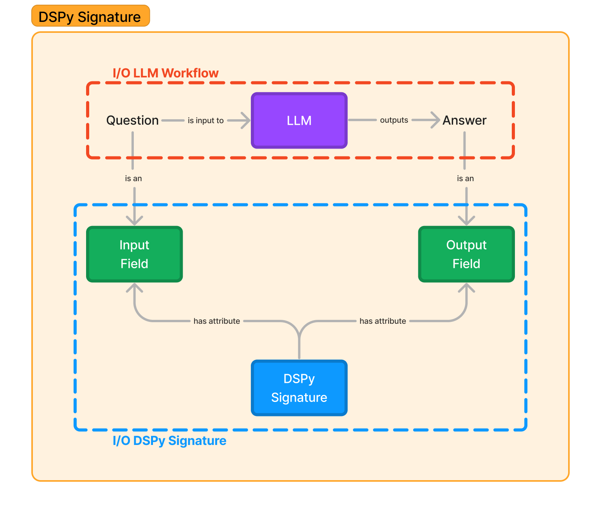
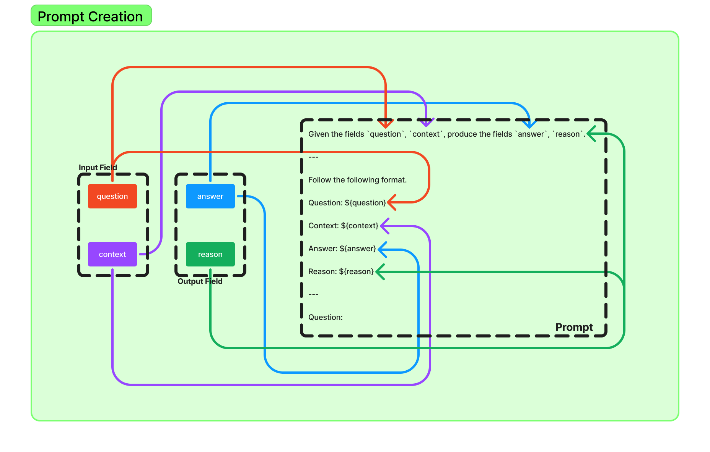
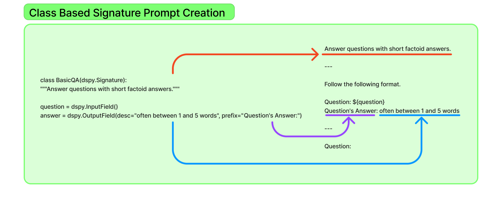

import AuthorDetails from '@site/src/components/AuthorDetails';

# 理解签名

DSPy 签名是任务描述的最基本形式，简单地需要输入和输出，还可以选择性地包含关于它们和任务的简要描述。

定义签名有两种方式：**内联**和**基于类**。但在深入创建签名之前，让我们先了解什么是签名以及为什么我们需要它。

## 什么是签名？

在典型的 LLM 流水线中，你会看到两个关键组件在工作，即一个 LLM 和一个提示。在 DSPy 中，我们通过 LM（语言模型 - 将在下一篇博客中介绍）在任何 DSPy 脚本的开头配置了一个 LLM，并通过 **签名** 定义了一个提示。

签名通常由两个基本组件组成：**输入字段** 和 **输出字段**。你可以选择性地传递一个指令，定义任务更严格的要求。**输入字段** 是签名的一个属性，定义了提示的输入，而 **输出字段** 是签名的一个属性，定义了从 LLM 调用接收到的提示的输出。让我们通过一个例子来理解这个概念。



让我们想象一个基本的问答任务，其中问题作为输入传递给 LLM，然后你会收到一个答案响应。在 DSPy 中，我们直接将这个映射为问题作为签名的 **输入字段**，答案作为签名的 **输出字段**。

现在我们了解了签名的组成部分，让我们看看如何声明一个签名以及该签名的提示是什么样的。

## 内联方法

DSPy 提供了一种直观简单的方法来定义任务：只需说明输入和输出以传达任务的最简形式。例如，如果你的输入是 **问题**，输出是 **答案**，那么很明显这个任务是一个问答任务。如果你的输入是 **上下文** 和 **问题**，输出是 **答案** 和 **理由**，这应该意味着某种形式的思维链提示，可能在 RAG 流水线内部。

受到这种简单性的启发，DSPy 签名反映了一种类似 Einops 的抽象方式：

```text
input_field_1,input_field_2,input_field_3...->output_field_1,output_field_2,output_field_3...
```

签名的 **输入字段** 在 `->` 的左侧声明，**输出字段** 在右侧。所以让我们继续为 QA 和 RAG 任务定义 DSPy 签名：

```text
QA 任务: 问题->答案
RAG 任务: 上下文,问题->答案,理由
```

这种简单的字段命名对于 LLM 理解输入和输出的性质至关重要，减少了敏感性，确保了对预期输入和生成的清晰性。
然而，这种简单的签名可能无法为模型如何处理任务提供清晰的指导，为了满足这些需求，DSPy 模块提供了简单但强大的教学模板，这些模板集成了签名。

让我们深入研究由 DSPy 构建的提示，以便在 `dspy.Predict` 模块中更好地理解它，格式如下 `dspy.Predict(question->answer)`：

```
给定字段 `question`，生成字段 `answer`。

---

按照以下格式。

问题: ${question}
答案: ${answer}

---

问题:
```

正如您所看到的，DSPy 填充指令 `给定字段 ``question``，生成字段 ``answer``.` 来定义任务，并为提示格式提供说明。这种格式对于您创建的任何签名都是非常标准的，正如我们在为 RAG 设置的提示中所看到的：



现在，这些教学模板针对各自的提示技术（CoT、ProgramOfThought、ReAct）进行了明确定义，用户只需定义其任务的签名输入和输出，其余工作由 DSPy 模块库处理！

然而，除了简单的内联签名外，给予更多指导将是很好的，为此，我们转向基于类的签名。

## 基于类的方法

签名类包括三个要素：

* **任务描述/说明：** 我们在签名类的文档字符串中定义。
* **输入字段：** 我们将其定义为 `dspy.InputField()`。
* **输出字段：** 我们将其定义为 `dspy.OutputField()`。

```python
class BasicQA(dspy.Signature):
    """用简短的事实性答案回答问题。"""

    question = dspy.InputField()
    answer = dspy.OutputField(desc="通常在 1 到 5 个单词之间", prefix="问题的答案:")
```

I/O 字段接受 3 个输入：`desc`、`prefix` 和 `format`。`desc` 是输入的描述，`prefix` 是提示中字段的占位文本（到目前为止一直是 `${field_name}`），`format` 是一个方法，将定义如何处理非字符串输入。如果输入到字段是列表而不是字符串，我们可以通过 `format` 指定这一点。

`InputField` 和 `OutputField` 在实现上也类似：

```python
class InputField(Field):
    def __init__(self, *, prefix=None, desc=None, format=None):
        super().__init__(prefix=prefix, desc=desc, input=True, format=format)

class OutputField(Field):
    def __init__(self, *, prefix=None, desc=None, format=None):
        super().__init__(prefix=prefix, desc=desc, input=False, format=format)
```

让我们看看基于类的签名的提示是什么样子的：

```text
用简短的事实性答案回答问题。

---

按照以下格式。

问题: ${question}
问题的答案: 通常在 1 到 5 个单词之间

---

问题:
```
正如你所看到的，我们任务的说明在文档字符串中更加明确定义了指令。`answer` 字段的前缀和描述反映了我们的定义。这确保了更精细的提示结构，让用户更多地控制根据任务要求定义其内容。



***

<AuthorDetails name="Herumb Shandilya"/>