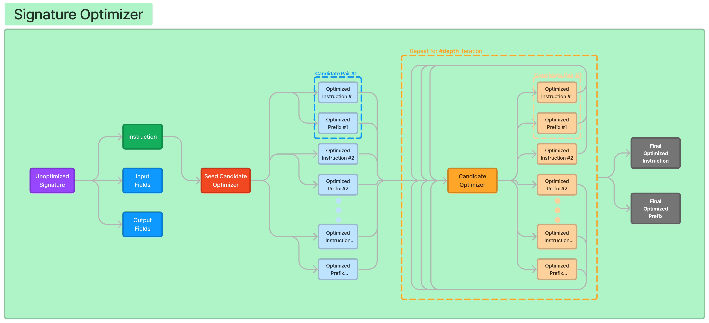

import AuthorDetails from '@site/src/components/AuthorDetails';

# 签名优化器

`COPRO` 旨在在零/少次迭代设置中改进模块中签名的输出前缀和指令。这个电讯台特别有利于微调语言模型的提示，确保它们能够更有效地执行任务，而这一切都是从一个模糊而粗糙的提示开始的。

## 设置一个样本流水线

我们将从头开始创建我们的 CoT 流水线，包括度量本身！所以让我们从配置 LM 开始，这里将使用 OpenAI LM 客户端，LLM 为 `gpt-3.5-turbo`。

```python
import dspy

turbo = dspy.OpenAI(model='gpt-3.5-turbo')
dspy.settings.configure(lm=turbo)
```

现在，LM 客户端设置好了，是时候导入 DSPy 提供的 `HotPotQA` 类中的训练-开发集分割了：

```python
from dspy.datasets import HotPotQA

dataset = HotPotQA(train_seed=1, train_size=20, eval_seed=2023, dev_size=50, test_size=0)

trainset, devset = dataset.train, dataset.dev
```

我们现在将为 QA 任务定义一个基于类的签名，类似于 `问题->答案`，并将其传递给 `ChainOfThought` 模块，通过 LM 客户端为这个签名提供思维链的结果。

```python
class CoTSignature(dspy.Signature):
    """回答问题并给出相同的推理。"""

    question = dspy.InputField(desc="关于某事的问题")
    answer = dspy.OutputField(desc="通常是 1 到 5 个词")

class CoTPipeline(dspy.Module):
    def __init__(self):
        super().__init__()

        self.signature = CoTSignature
        self.predictor = dspy.ChainOfThought(self.signature)

    def forward(self, question):
        result = self.predictor(question=question)
        return dspy.Prediction(
            answer=result.answer,
            reasoning=result.rationale,
        )
```

现在我们也需要评估这个流水线！所以我们将使用 DSPy 提供的 `Evaluate` 类，作为度量标准，我们将使用我们定义的 `validate_context_and_answer`。`validate_context_and_answer` 使用 DSPy 中的 `dspy.evaluate.answer_exact_match` 度量标准，本质上是看预测和示例是否相同。

```python
from dspy.evaluate import Evaluate

def validate_context_and_answer(example, pred, trace=None):
    answer_EM = dspy.evaluate.answer_exact_match(example, pred)
    return answer_EM

NUM_THREADS = 5
evaluate = Evaluate(devset=devset, metric=validate_context_and_answer, num_threads=NUM_THREADS, display_progress=True, display_table=False)
```

为了评估 `CoTPipeline`，我们需要创建一个它的对象，并将其作为参数传递给 `evaluator` 调用。

```python
cot_baseline = CoTPipeline()

devset_with_input = [dspy.Example({"question": r["question"], "answer": r["answer"]}).with_inputs("question") for r in devset]
evaluate(cot_baseline, devset=devset_with_input)
```
现在我们已经准备好使用基准管道，让我们尝试使用 `COPRO` 电讯提示器，并优化我们的管道，使其变得更好！

## 使用 `COPRO`

让我们从导入和初始化我们的电讯提示器开始，对于我们将使用的度量，我们将使用上面导入和使用的 `validate_context_and_answer`：

```python
from dspy.teleprompt import COPRO

teleprompter = COPRO(
    metric=validate_context_and_answer,
    verbose=True,
)
```

在这个电讯提示器中，有一个广度和深度参数，用于定义指令/前缀候选的数量以及优化步骤中的迭代次数。我们将在下一节深入了解这一点。这个电讯提示器为签名提供了更好的指令候选和输出字段的更好前缀候选。让我们通过调用电讯提示器中的 `compile` 方法来开始优化我们的 `CoT` 模块：

```python
kwargs = dict(num_threads=64, display_progress=True, display_table=0) # 用于优化过程中的 Evaluate 类

compiled_prompt_opt = teleprompter.compile(cot, trainset=devset, eval_kwargs=kwargs)
```

一旦训练完成，您将获得更好的指令和前缀，需要手动编辑签名。所以假设在优化过程中输出如下：

```text
i: "请回答问题并解释您的答案的理由。您的回答应该清晰详细，解释您决定的基本原理。请确保您的答案经过合理推理，并得到相关解释和例子的支持。"
p: "[Rationale]"
平均度量 (78.9) ...
```

然后您将复制这个内容，并编辑原始指令类为：

```python
class CoTSignature(dspy.Signature):
    """请回答问题并解释您的答案的理由。您的回答应该清晰详细，解释您决定的基本原理。请确保您的答案经过合理推理，并得到相关解释和例子的支持。"""

    question = dspy.InputField(desc="关于某事的问题")
    reasoning = dspy.OutputField(desc="答案的理由", prefix="[Rationale]")
    answer = dspy.OutputField(desc="通常是1到5个词之间")
```

:::info
前缀仅针对首先定义的输出字段提出，即 `CoTSignature` 中的 reasoning。
:::

重新初始化管道对象并重新评估管道！现在您拥有一个更强大的预测器，具有更优化的签名！

## `COPRO` 是如何工作的？

有趣的是，为了获得最佳前缀和指令，`COPRO` 使用了签名。基本上 `COPRO` 使用签名来优化签名！！让我们更仔细地看一下代码库：
```python
class BasicGenerateInstruction(Signature):
    """你是大型语言模型的指令优化器。我会给你一个用英语描述的“签名”（包括输入和输出字段）。你的任务是提出一条指令，让一个优秀的语言模型能够很好地执行任务。不要害怕发挥创造力。"""

    basic_instruction = dspy.InputField(desc="优化前的初始指令")
    proposed_instruction = dspy.OutputField(desc="针对语言模型的改进指令")
    proposed_prefix_for_output_field = dspy.OutputField(desc="提示末尾的字符串，将帮助模型开始解决任务")

class GenerateInstructionGivenAttempts(dspy.Signature):
    """你是大型语言模型的指令优化器。我会给你一些我尝试过的任务指令，以及它们对应的验证分数。这些指令按照得分递增的顺序排列，得分越高表示质量越好。

你的任务是提出一条新的指令，让一个优秀的语言模型能够执行任务得更好。不要害怕发挥创造力。"""

    attempted_instructions = dspy.InputField(format=dsp.passages2text)
    proposed_instruction = dspy.OutputField(desc="针对语言模型的改进指令")
    proposed_prefix_for_output_field = dspy.OutputField(desc="提示末尾的字符串，将帮助模型开始解决任务")
```
这两个签名是为我们提供最佳指令和前缀的基础。现在，`BasicGenerateInstruction` 将根据 `breadth` 参数生成 `n` 条指令和前缀，基本上是 `n=breadth`。这仅在开始时进行一次，用于初始化指令尝试。

它使用这些指令并将它们传递给 `GenerateInstructionGivenAttempts`，后者希望输出更优化的指令。然后在 DSPy 中进行 `m` 次迭代，这是深度参数。



让我们逐步分解这个过程：

1. **起始点：** 使用 BasicGenerateInstruction 创建初始优化指令和前缀。这是基于基本指令输入的。
2. **迭代改进：** 将这些初始指令传递给 GenerateInstructionGivenAttempts。
3. **重复优化：** 在每次迭代中（最多 m 次）：
    - 评估当前指令及其有效性。
    - 根据评估提出新的、更优化的指令和前缀。
4. **结果：** 经过 m 次迭代后，系统理想情况下会收敛到一组高度优化的指令和相应前缀，从而提高语言模型在给定任务上的性能。

这种迭代方法允许持续改进指令和前缀，利用电子提示器的优势，并随着时间的推移提高任务性能。

***

<AuthorDetails name="Herumb Shandilya"/>